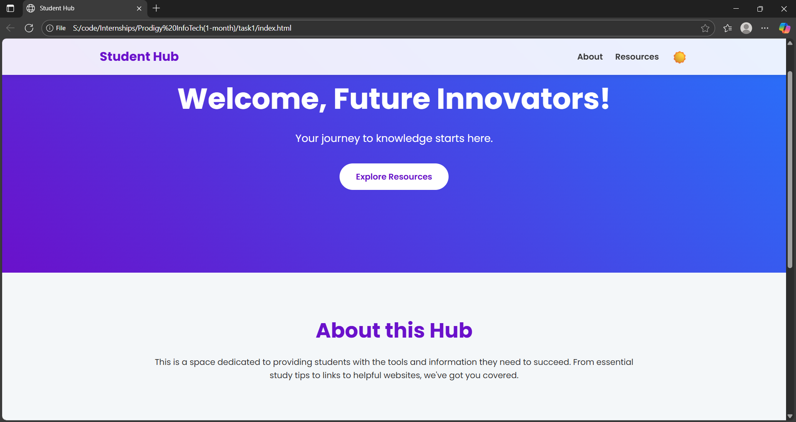
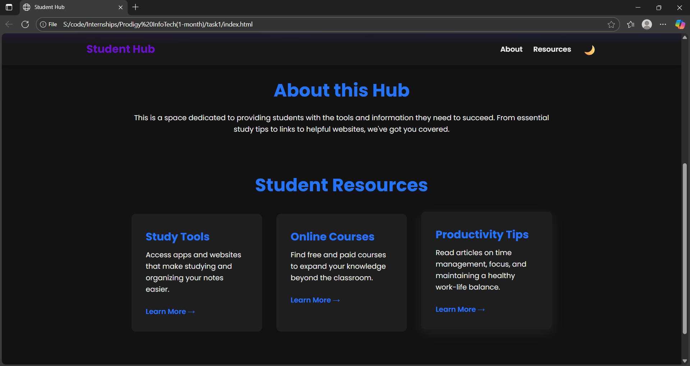

# 📚 Student Hub

A simple and modern **student resource hub website** built with **HTML, CSS, and JavaScript**.
It provides a clean interface with **dark/light mode**, smooth animations, and useful sections like **About** and **Resources**.

---

## 🚀 Features

* 🌗 **Light/Dark Mode Toggle** – switch between modes with one click.
* 📜 **Scroll Effects** – navigation bar changes on scroll.
* ✨ **Fade-in Animations** – smooth reveal effects for sections.
* 🎨 **Responsive Design** – works across desktop, tablet, and mobile devices.
* 📖 **Student Resources Section** – cards for Study Tools, Online Courses, and Productivity Tips.

---

## 📂 Project Structure

```
├── index.html   # Main HTML file
├── style.css    # Styles (light/dark themes, layout, animations)
└── script.js    # JavaScript (scroll, theme toggle, animations)
```

---

## 📸 Screenshots

### 🌞 Light Mode



### 🌙 Dark Mode



---
